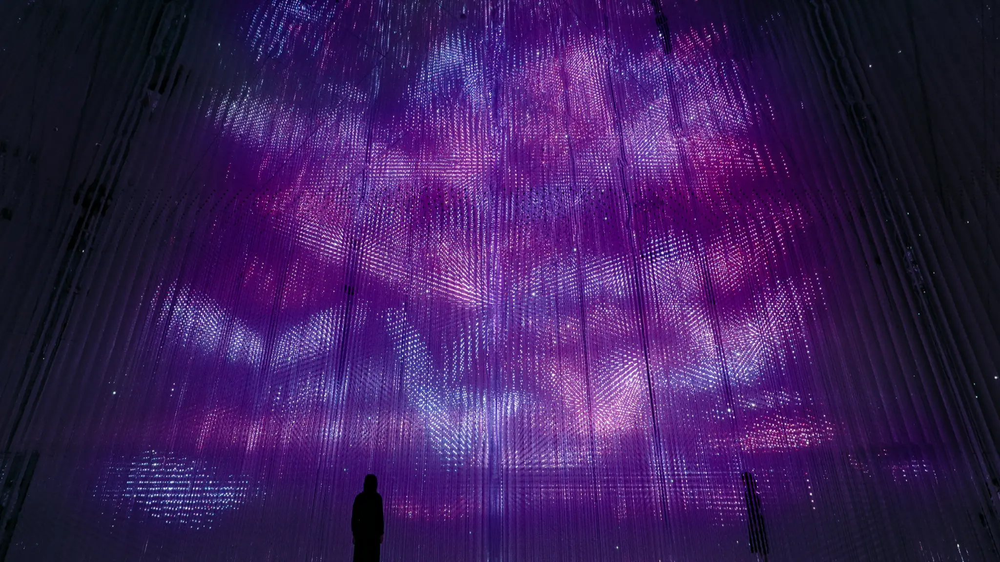
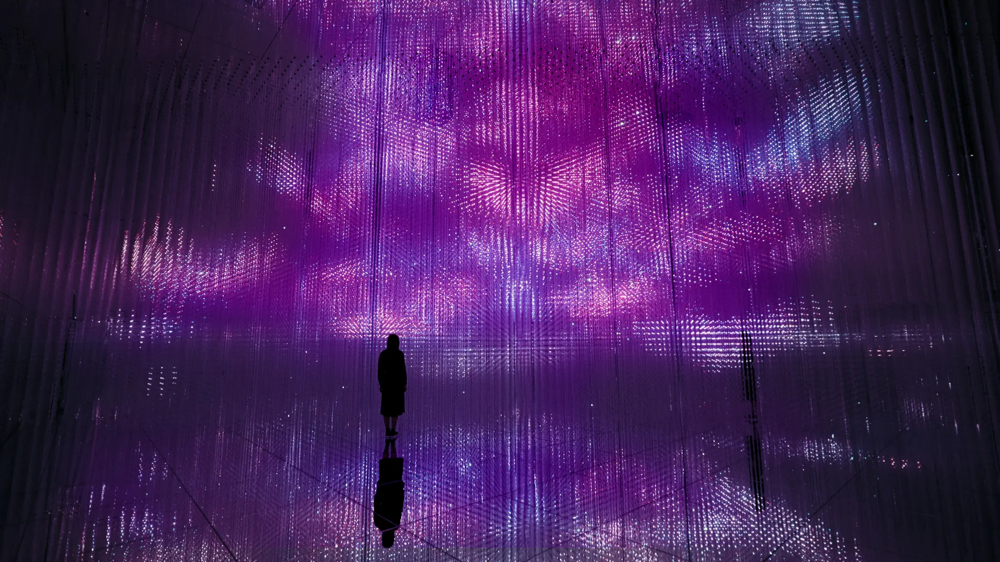
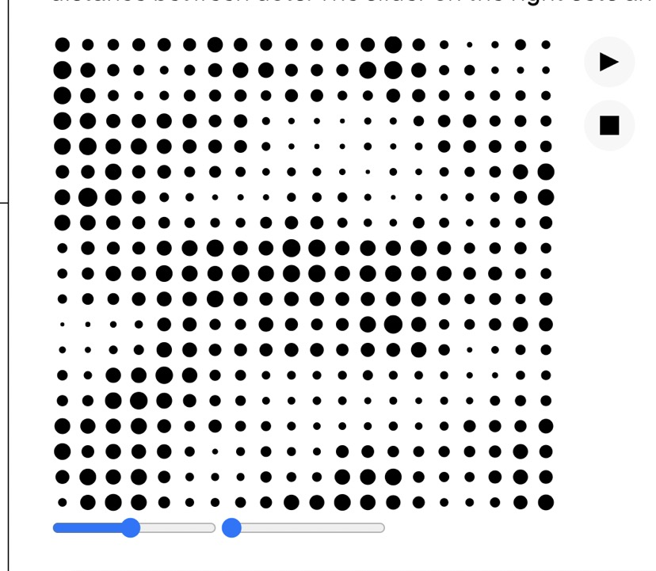
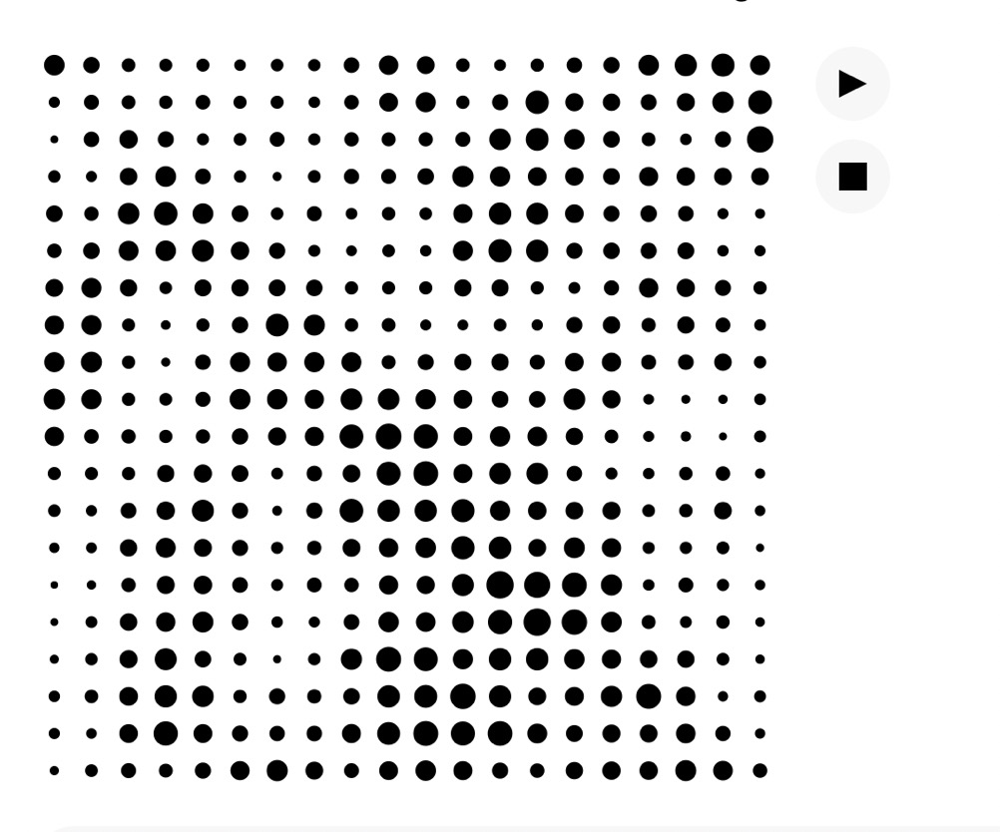

# xche0015_9103_tut04

## part1：Imaging technology Inspiration

1.

2.The work I chose is craystal world on teamlab. This artwork uses the artistic technique of pointillism, presenting a crystal world composed of a collection of light points, and constantly produces random changes. The different changes of light points at every moment create artistic pictures. This dynamic and layered artwork inspired my creative inspiration. I hope to use p5.js to create similar artworks, presenting a flowing, orderly and random artwork through the changes of different points or lines.

## part2：Programming Technology Exploration

1.

2.
In order to create a similar dot matrix effect, we use a noise function in p5.js to simulate the random change of flash points, and use the circle function to create the effect of small flash points. By adjusting the gapSlider to control the distance between the dots, we can achieve a partially distant and partially dense presentation effect. By changing the offset, we can control the spacing and movement of the dots. Through these techniques, we can achieve the artistic effect of the reference image.

3.
[Inspiration Link](https://p5js.org/examples/repetition-noise/)

4.
// Noise tends to look smoother with coordinates that are very close together
// These values will be multiplied by the x and y coordinates to make the
// resulting values very close together
let xScale = 0.015;
let yScale = 0.02;

let gapSlider;
let gap;
let offsetSlider;
let offset;

function setup() {
  createCanvas(400, 400);

  // Set up the sliders
  gapSlider = createSlider(2, width / 10, width / 20);
  gapSlider.changed(dotGrid);
  gapSlider.mouseMoved(checkChanged);
  offsetSlider = createSlider(0, 1000, 0);
  offsetSlider.mouseMoved(checkChanged);

  // Draw the grid
  dotGrid();
}

// When the mouse is moved over a slider
// Draw the dot grid if something has changed
function checkChanged() {
  if (gap !== gapSlider.value()) {
    dotGrid();
  }
  if (offset !== offsetSlider.value()) {
    dotGrid();
  }
}

function dotGrid() {
  background(255);
  noStroke();
  fill(0);

  // Get the current gap and offset values from the sliders
  gap = gapSlider.value();
  offset = offsetSlider.value();

  // Loop through x and y coordinates, at increments set by gap
  for (let x = gap / 2; x < width; x += gap) {
    for (let y = gap / 2; y < height; y += gap) {
      // Calculate noise value using scaled and offset coordinates
      let noiseValue = noise((x + offset) * xScale, (y + offset) * yScale);

      // Since noiseValue will be 0-1, multiply it by gap to set diameter to
      // between 0 and the size of the gap between circles
      let diameter = noiseValue * gap;
      circle(x, y, diameter);
    }
  }
}

